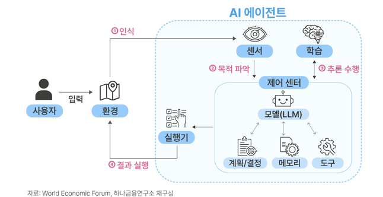
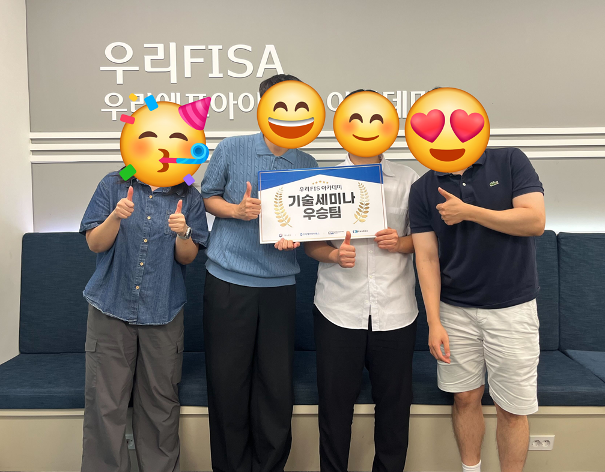

# agent-mcp

### 개요
* 금융 IT 도메인에 AI Agent 와 MCP(Model Context Protocol) 개념을 접목 가능한지 검토하였고, 대출 심사 프로세스를 경량 PoC 코드로 구현하였습니다.

### Assistant, AI Agent 비교
* Assistant: 사용자 데이터를 일부 활용하여 (캘린더, 이메일 등) 반복적인 task 를 부분 자동화 가능. multistep 작업이 가능하지만, 중간 과정에 대부분 사용자가 주도
* AI Agent: 목표 기반으로 작업을 스스로 설계하고 실행하고, 자체적으로 필요 도구를 선정해 외부 도구 호출이 가능

### AI Agent 작동 방식

### 디자인 패턴과 오케스트레이션
* 디자인 패턴: LLM -> 자율적 문제 해결 시스템으로 고도화하기 위한 구조적 설계 패턴
  * Reflection Pattern
  * Tool Use Pattern
  * React Pattern
  * Planning pattern
  * Multi-Agent Pattern (오케스트레이션과 연관)

* 오케스트레이션: 여러 특화 작업과 기능을 가진 AI Agent 가 최종 목표를 달성하기 위해서 서로 협력 / 조정 / 관리 프로세스

### MCP
* Anthropic 에서 발표한 프로토콜로 LLM 모델이 외부 어플리케이션과 연동할 수 있도록 도와주는 도구 (프로토콜로 연결되어 기능 연동이 간편하고, 유지보수성이 개선됨)

### 대출 심사 프로세스
* 위 개념을 우리Won 주택 대출 상품에 적용해보았습니다.

### PoC 구현
* LangGraph 와 MCP 를 이용해서 구현하였고, LangSmith 를 통해 시각화하였습니다.
* 개발환경
  * LLM 플랫폼 : Ollama
  * LLM 모델 :  qwen3:8b

### AI Agent, MCP 보안
* 금융보안원에서 AI Agent, MCP 와 관련하여 위협 보고서를 공개
* 에이전트 하이재킹과 도구 오염에 대한 위협이었음.
* 위 문제로 인해 비정상적 대출 승인 등의 위협이 발생할 수 있음
* 대응 방안으로 다음 내용을 검토하였습니다.
  * 상호 주고받는 민감 데이터 보호를 위해 암호화
  * 악성 프롬프트 탐지 및 차단
  * RBAC (Role-Based Access Control) 역할 기반 모델 접근 제어
  * AI 활용하여 이상 패턴을 감지
  * MCP 상호 작용에 대한 감시 및 추적

### 팀원 & 역할분담
* 김성현: 시나리오 검토 및 발표
* 민지수: 오케스트레이션 및 디자인 패턴
* 김성욱: 오케스트레이션 및 MCP
* 윤호준: MCP 및 보안 측면 검토

### 결과
* 위 주제로 진행한 우리 FISA 5기 기술세미나에서 우승하였습니다.
